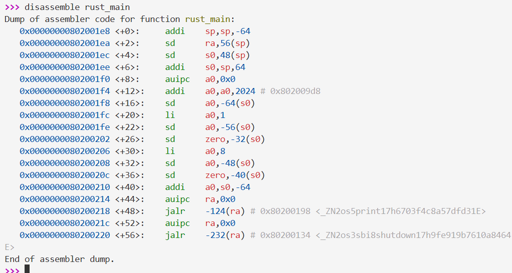
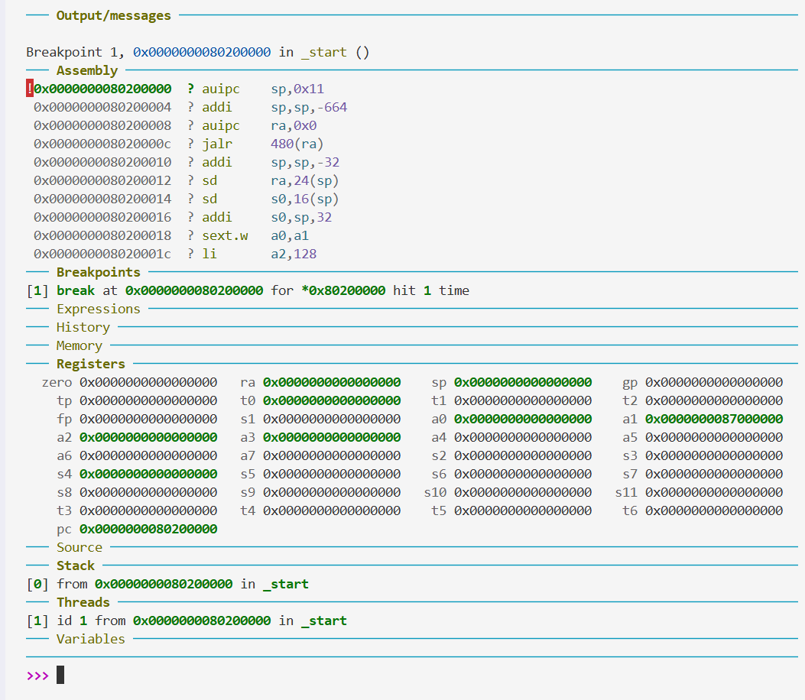
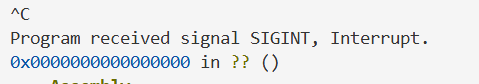
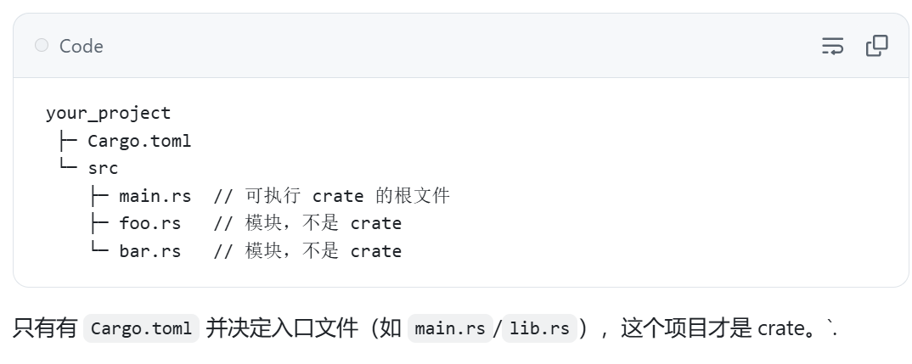

# ch1 做了什么
### 一句话： 一个刚开机就关机的riscv裸机系统
  * 只用rust core特性, 在riscv平台上实现系统的开机和关机.
  * linker.ld一度非常头疼，需要正确链接， 奇怪是实验不要求自己写
  * 熟悉 qemu-gdb 调试的基本方法 (见下)
  * entry.asm, 相信后面作开机引导的时候会不断遇到
* 总的来说， ch1 最大的作用是熟悉rCore系列实验环境， 而非构建什么东西

---
debug log:
* 这正是全新的rust_main入口！ 而且成功走shut_down()退出的。不知道为什么print没有成功打印， 我认为这不是ch1的重点， 决定跳过

 
 成功进入预设的_start(), lab1基本完成
* 是编译的问题， 下面给出一个gdb调试版
  * cargo build --release (注意， 不带release会到bug目录)
  * rust-objcopy --binary-architecture=riscv64 target/riscv64gc-unknown-none-elf/release/os --strip-all -O binary target/riscv64gc-unknown-none-elf/release/os.bin (把linux格式的可执行文件转换成二进制， 因为我们是直接在riscv裸机上跑)
  * qemu-system-riscv64 -machine virt -nographic -bios ../bootloader/rustsbi-qemu.bin -device loader,file=target/riscv64gc-unknown-none-elf/release/os.bin,addr=0x80200000  -s -S
  * 其中 -s 代表转发到端口 1234， -S 代表先暂停着， 方便从头开始调试
  * 打开另一个终端：
  * riscv64-unknown-elf-gdb target/riscv64gc-unknown-none-elf/release/os
  * 连接：
  * (gdb)target remote : 1234
    (gdb)break *0x80200000  
    (gdb)continue

* rust-objdump -S target/riscv64gc-unknown-none-elf/release/os > assemble_all_in_one.asm 
反汇编命令查看

* 下面这段是我自己非常喜欢的一段, 放到这里对初学者不是很友好：
```[language = rust]
#[no_mangle]
fn clear_bss() {
    extern "C" {
        fn sbss();
        fn ebss();
    }
    (sbss as usize..ebss as usize).for_each(|a| {
                                                        //sbss 本身是 ptr， 转换成usize
                                                        // .. 创建了一个范围
                                                        // 直接把范围当成对象用， 第一眼看很离谱， 看多了就好了
        unsafe { (a as *mut u8).write_volatile(0);}
                                                        // a as *mut u8 ， 把a转换成可变的u8指针
                                                        // unsafe 绕过rust安全检查， 才能直接操作内存
                                                        // volatile 确保每次的写入不会被编译器优化
    });
}
```

---
挣扎期
* 最后一步退出卡住了， gdb查看发现entry.asm没有成功被链接
      
* #[...]：outer attribute，放在项（item）之前（例如放在结构体、函数、模组、crate 外部等）来修饰该项或被编译器读取。
例： #[derive(Debug)] struct S;
#![...]：inner attribute，使用 ! 放在 item 内部（常见于 crate 根的 lib.rs / main.rs 顶部），其作用是修饰包含它的那个项（典型的是修饰整个 crate）。
例：在 crate 根写 #![no_std] 或 #![allow(dead_code)]

* 区分mod crate:



* 调用链：


learning log:

* 层次结构：


* core 库是 Rust 最底层的库，它被设计为：  
  * 无依赖：不依赖任何操作系统功能
  * 可移植：可以在任何平台上运行，包括裸机
  * 最小化：只包含最基本的语言功能

* rust 库层级包含了 std, alloc, core, 其中只有std依赖os

* refer


* ELF 可执行文件, Executable and Linkable Format - Linux/Unix 系统的标准可执行文件格式。

* 特性（trait）概念接近于 Java 中的接口（Interface）
* impl <特性名> for <所实现的类型名>
# rCore-Tutorial-Code-2025S

### Code
- [Soure Code of labs for 2025S](https://github.com/LearningOS/rCore-Tutorial-Code-2025S)
### Documents

- Concise Manual: [rCore-Tutorial-Guide-2025S](https://LearningOS.github.io/rCore-Tutorial-Guide-2025S/)

- Detail Book [rCore-Tutorial-Book-v3](https://rcore-os.github.io/rCore-Tutorial-Book-v3/)


### OS API docs of rCore Tutorial Code 2025S
- [OS API docs of ch1](https://learningos.github.io/rCore-Tutorial-Code-2025S/ch1/os/index.html)
  AND [OS API docs of ch2](https://learningos.github.io/rCore-Tutorial-Code-2025S/ch2/os/index.html)
- [OS API docs of ch3](https://learningos.github.io/rCore-Tutorial-Code-2025S/ch3/os/index.html)
  AND [OS API docs of ch4](https://learningos.github.io/rCore-Tutorial-Code-2025S/ch4/os/index.html)
- [OS API docs of ch5](https://learningos.github.io/rCore-Tutorial-Code-2025S/ch5/os/index.html)
  AND [OS API docs of ch6](https://learningos.github.io/rCore-Tutorial-Code-2025S/ch6/os/index.html)
- [OS API docs of ch7](https://learningos.github.io/rCore-Tutorial-Code-2025S/ch7/os/index.html)
  AND [OS API docs of ch8](https://learningos.github.io/rCore-Tutorial-Code-2025S/ch8/os/index.html)
- [OS API docs of ch9](https://learningos.github.io/rCore-Tutorial-Code-2025S/ch9/os/index.html)

### Related Resources
- [Learning Resource](https://github.com/LearningOS/rust-based-os-comp2022/blob/main/relatedinfo.md)


### Build & Run

```bash
# setup build&run environment first
$ git clone https://github.com/LearningOS/rCore-Tutorial-Code-2025S.git
$ cd rCore-Tutorial-Code-2025S
$ git clone https://github.com/LearningOS/rCore-Tutorial-Test-2025S.git user
$ cd os
$ git checkout ch$ID
# run OS in ch$ID
$ make run
```
Notice: $ID is from [1-9]

### Grading

```bash
# setup build&run environment first
$ git clone https://github.com/LearningOS/rCore-Tutorial-Code-2025S.git
$ cd rCore-Tutorial-Code-2025S
$ rm -rf ci-user
$ git clone https://github.com/LearningOS/rCore-Tutorial-Checker-2025S.git ci-user
$ git clone https://github.com/LearningOS/rCore-Tutorial-Test-2025S.git ci-user/user
$ git checkout ch$ID
# check&grade OS in ch$ID with more tests
$ cd ci-user && make test CHAPTER=$ID
```
Notice: $ID is from [3,4,5,6,8]