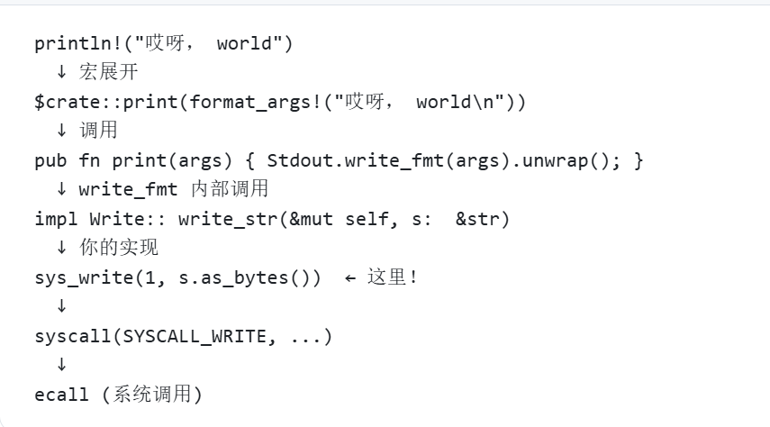
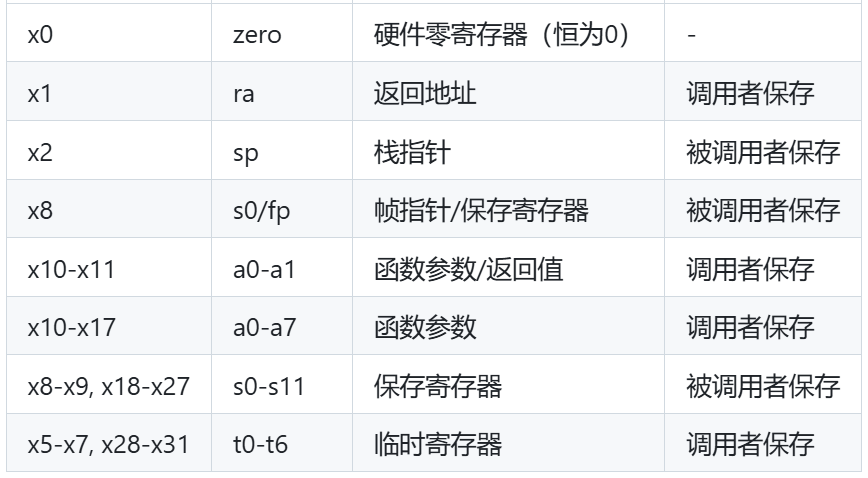

---
debug log:

* 调用链：


learning log:

* 层次结构：


* core 库是 Rust 最底层的库，它被设计为：  
  * 无依赖：不依赖任何操作系统功能
  * 可移植：可以在任何平台上运行，包括裸机
  * 最小化：只包含最基本的语言功能

* rust 库层级包含了 std, alloc, core, 其中只有std依赖os

* refer


* rust-objdump -S target/riscv64gc-unknown-none-elf/debug/os 反汇编命令查看

* ELF 可执行文件, Executable and Linkable Format - Linux/Unix 系统的标准可执行文件格式。

* 特性（trait）概念接近于 Java 中的接口（Interface）
* impl <特性名> for <所实现的类型名>
# rCore-Tutorial-Code-2025S

### Code
- [Soure Code of labs for 2025S](https://github.com/LearningOS/rCore-Tutorial-Code-2025S)
### Documents

- Concise Manual: [rCore-Tutorial-Guide-2025S](https://LearningOS.github.io/rCore-Tutorial-Guide-2025S/)

- Detail Book [rCore-Tutorial-Book-v3](https://rcore-os.github.io/rCore-Tutorial-Book-v3/)


### OS API docs of rCore Tutorial Code 2025S
- [OS API docs of ch1](https://learningos.github.io/rCore-Tutorial-Code-2025S/ch1/os/index.html)
  AND [OS API docs of ch2](https://learningos.github.io/rCore-Tutorial-Code-2025S/ch2/os/index.html)
- [OS API docs of ch3](https://learningos.github.io/rCore-Tutorial-Code-2025S/ch3/os/index.html)
  AND [OS API docs of ch4](https://learningos.github.io/rCore-Tutorial-Code-2025S/ch4/os/index.html)
- [OS API docs of ch5](https://learningos.github.io/rCore-Tutorial-Code-2025S/ch5/os/index.html)
  AND [OS API docs of ch6](https://learningos.github.io/rCore-Tutorial-Code-2025S/ch6/os/index.html)
- [OS API docs of ch7](https://learningos.github.io/rCore-Tutorial-Code-2025S/ch7/os/index.html)
  AND [OS API docs of ch8](https://learningos.github.io/rCore-Tutorial-Code-2025S/ch8/os/index.html)
- [OS API docs of ch9](https://learningos.github.io/rCore-Tutorial-Code-2025S/ch9/os/index.html)

### Related Resources
- [Learning Resource](https://github.com/LearningOS/rust-based-os-comp2022/blob/main/relatedinfo.md)


### Build & Run

```bash
# setup build&run environment first
$ git clone https://github.com/LearningOS/rCore-Tutorial-Code-2025S.git
$ cd rCore-Tutorial-Code-2025S
$ git clone https://github.com/LearningOS/rCore-Tutorial-Test-2025S.git user
$ cd os
$ git checkout ch$ID
# run OS in ch$ID
$ make run
```
Notice: $ID is from [1-9]

### Grading

```bash
# setup build&run environment first
$ git clone https://github.com/LearningOS/rCore-Tutorial-Code-2025S.git
$ cd rCore-Tutorial-Code-2025S
$ rm -rf ci-user
$ git clone https://github.com/LearningOS/rCore-Tutorial-Checker-2025S.git ci-user
$ git clone https://github.com/LearningOS/rCore-Tutorial-Test-2025S.git ci-user/user
$ git checkout ch$ID
# check&grade OS in ch$ID with more tests
$ cd ci-user && make test CHAPTER=$ID
```
Notice: $ID is from [3,4,5,6,8]